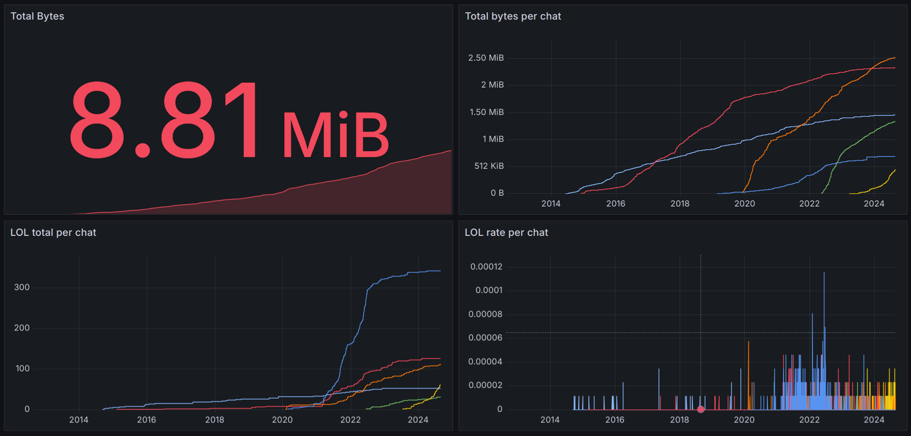

# tgstat
Visualize Telegram chat statistics with VictoriaMetrics and Grafana. Your data stays on your machine.



## Prerequisites
All you need is [Docker](https://docs.docker.com/get-docker/) and [JSON exports of your Telegram chats](https://telegram.org/blog/export-and-more).

## How to use
1. Run `docker compose up` to start the services.
2. Place your JSON exports in subdirectories of the chat-exports directory, e.g. `chat-exports/that-weirdo/result.json`.
3. Analyze and upload with `docker compose up tgstat`
4. Open Grafana at [http://localhost:3000](http://localhost:3000) and log in with `admin`/`admin`.
5. Edit the [sample dashboard](http://localhost:3000/d/fdvw01bp63jlsf/my-chats?orgId=1) or [explore your data](http://localhost:3000/explore?schemaVersion=1&panes=%7B%22z2x%22:%7B%22datasource%22:%22P4169E866C3094E38%22,%22queries%22:%5B%7B%22refId%22:%22A%22,%22expr%22:%22sum%20by%28file%29%20%28tg_bytes_total%29%22,%22range%22:true,%22instant%22:true,%22datasource%22:%7B%22type%22:%22prometheus%22,%22uid%22:%22P4169E866C3094E38%22%7D,%22editorMode%22:%22builder%22,%22legendFormat%22:%22__auto%22,%22useBackend%22:false,%22disableTextWrap%22:false,%22fullMetaSearch%22:false,%22includeNullMetadata%22:true%7D%5D,%22range%22:%7B%22from%22:%22now-15y%22,%22to%22:%22now%22%7D%7D%7D&orgId=1).
6. ???
7. Profit!

## Config

### Aliases
Some of my friends have long and unwieldy nicknames that I don't want to show up in Grafana.
You can define aliases in the `configs/aliases.json` file. The format is as follows:
```json
{
    "old name": "new name",
    "another old name": "another new name"
}
```

## Metrics

All metrics are prefixed with `tg_` and have a label `file` that shows the input file.
They usually have a `sender` label as well, which shows the sender of the message.

Hack around in [metrics.go](metrics.go) to add your own metrics.

### tg_messages_total

The `tg_messages_total` metric shows how many messages are sent in a chat.

### tg_bytes_total

The `tg_bytes_total` metric shows how many bytes are sent in a chat.

### tg_expressions_total

The `tg_expressions_total` metric shows how often certain expressions are used in a chat.
You can define expressions in the `configs/expressions.json` file. The format is as follows:
```json
{
    "expression": "description",
    "another expression": "another description"
}
```

Expressions are defined as [regular expressions in Go](https://pkg.go.dev/regexp).
You can use [regex101](https://regex101.com/) to test your expressions.

## Dashboards

If you export dashboards from Grafana, you can place them in the `configs/dashboards` directory.
They will be [provisioned](https://grafana.com/docs/grafana/latest/administration/provisioning/#dashboards) the next time you reset Grafana.